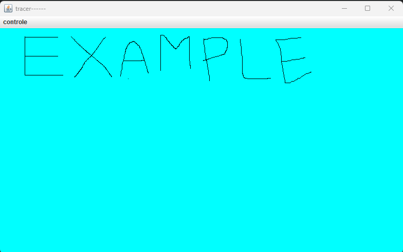

TraceurDessinJava

Ce projet est une application graphique Java permettant de dessiner à l'écran avec la souris. Il utilise JPanel et gère les événements de la souris pour tracer des lignes et points. Le projet contient des fonctionnalités supplémentaires comme la modification de l'épaisseur du trait et la réinitialisation du dessin.

Fonctionnalités :

  Dessiner en cliquant et en faisant glisser la souris.
  Tracer des lignes en appuyant sur les touches directionnelles du clavier.
  Effacer le contenu du panneau de dessin.
  Sélectionner l'épaisseur du trait via un menu contextuel.
  
Utilisation :

  Pour commencer à dessiner, cliquez dans la fenêtre et faites glisser la souris.
  Utilisez les flèches du clavier pour tracer des lignes point par point.
  Sélectionnez l'épaisseur du trait via le menu "PX" dans la barre de menus.
  Cliquez sur "effacer" dans le menu "contrôle" pour réinitialiser le panneau de dessin.
  
Exigences :

  Java 8 ou supérieur.
